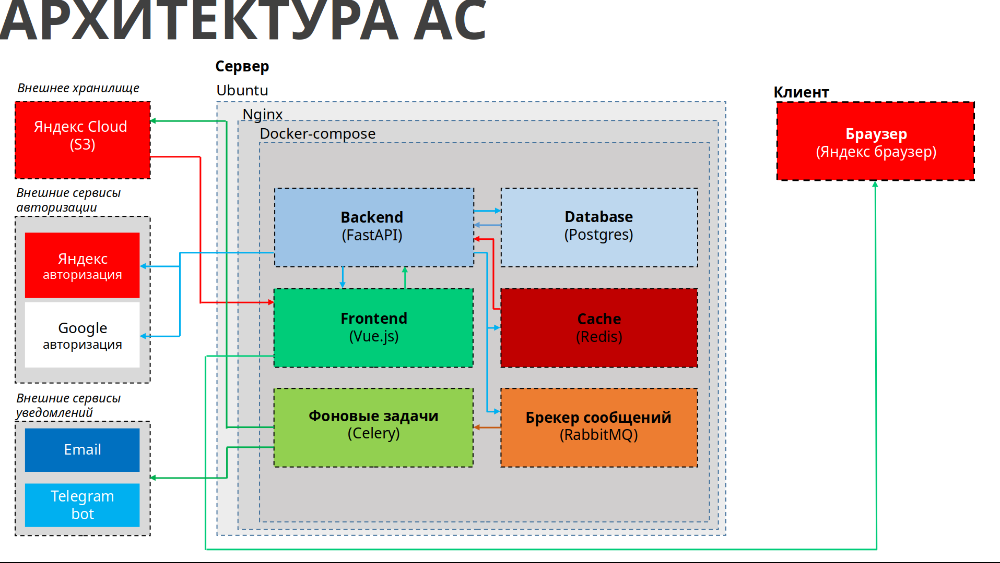

# [Календарь событий]()
### Проект разработан в рамках отборочного тура ЦФО от Федерации Спортивного Программирования в дисциплине Продуктовое программирование, на создание прототипа выделялось 48 часов.
---
#### Проект подразумевает собой информациооную систему, которая предоставляет собой колендарь событий (соревнований) для тренеров и спортсменов. Что позволит им отслеживать близжайшие соревнования, настраивать напоминания о соревнованиях по почте и через телеграмм бота, информация о соревнованиях парсится с сайта [Министерства спорта России](https://www.minsport.gov.ru/activity/government-regulation/edinyj-kalendarnyj-plan/).
---
### Стек и архитектура проекта:
   